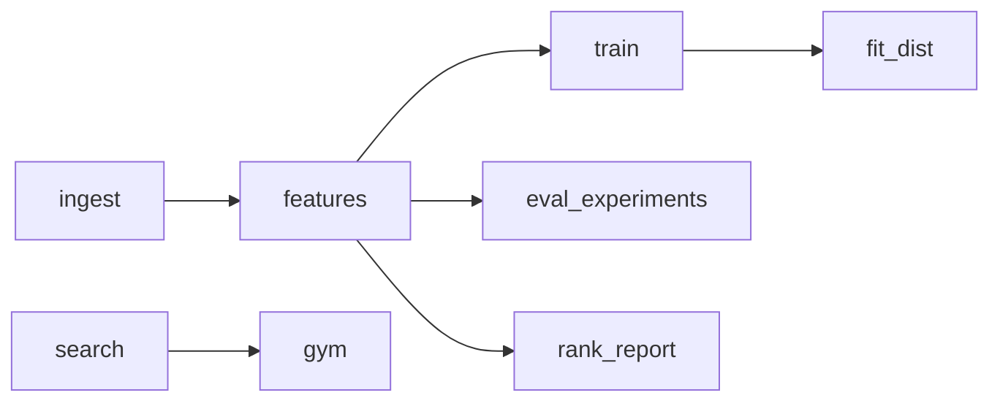

# Pipelines (DVC)

The repo is a set of *recipes* (scripts) with no executable dependency graph.
DVC (`dvc.yaml`) is the glue: it declares stages over existing scripts, their
inputs (`deps`), outputs, configuration (`params`), and results (`metrics`)
— so `dvc repro` runs only what changed and `dvc.lock` pins reproducibility.

This is a small integration over the real data, model, search, and evaluation
recipes. Extend it by adding stages and connecting a stage's output to another
stage's input.

## What each file does

| Path | Role |
|---|---|
| `dvc.yaml` | Stage graph: `cmd` / `deps` / `metrics` / `params` |
| `params.yaml` | Stage knobs (config is an input, not magic: change a param → only affected stages rerun) |
| `dvc.lock` | Committed record of exact input hashes + outputs for the last `dvc repro` |
| `.dvcignore` | Files never tracked as deps/outs (venv, caches, notebooks, profile dumps) |
| `.dvc/cache/` | DVC content cache (gitignored); `data/processed` is already gitignored too |
| `experiments/artifacts/.gitignore` | DVC marks metric files as untracked; full report JSONs stay git-tracked |

## Stages



- `ingest` — builds the parquet dataset (`scripts/ingest.py`); a side-effect
  node (kept at the head; outputs already gitignored under `data/processed`).
- `features` — feature-store build for a season → `features_{season}.parquet`.
- `train` — `scripts/train_tree.py` → `points_lgbm.txt` + `data/processed/mae.json`
  (DVC metrics: tree + baseline MAE/RMSE).
- `fit_dist` — distributional forecast → `dist_{season}.parquet`.
- `eval_experiments` — declared-run harness → full artifact (git-tracked) +
  flat `*.metrics.json` (DVC-managed).
- `rank_report` — ranking-ability report + `ranking.metrics.json`.
- `search` — scores and ranks candidate squads, emitting
  `search_candidates.parquet` and compact search metrics.
- `gym` — consumes the candidate artifact and replays it against actuals,
  emitting the canonical gym observability document and compact metrics.

A stage **emits its own metrics at compute time**; DVC only *reads* them
(`dvc metrics show`). Full documents stay the git record; the small metric
files are the DVC outputs. (The first `dvc repro` also surfaced and fixed a
latent `gw_target` rename bug in `fpl/team/distribution.py`.)

## Commands (agent cheat-sheet)

```bash
dvc repro                # run only outdated stages (best via `uv run dvc ...`)
dvc repro rank_report    # run one stage
dvc status               # what changed vs dvc.lock
dvc dag                  # render the stage graph
dvc metrics show         # read the emitted metrics files
```

## Composition rules (how to grow this)

1. **Add a stage** = add a `stages.<name>` block whose `cmd` wraps an existing
   script. Inputs it reads → `deps`; scalars it is configured by → `params`;
   numbers it produces → `metrics` (emit a small JSON inside the script).
2. **Chain two jobs** = put the producer's output in the consumer's `deps`.
   `dvc.repro` then knows the consumer depends on the producer and reruns it
   when the producer's output hash changes.
3. **Param-driven invalidation** — change `rounds`/`seasons` in `params.yaml`
   and only the stages that read them rerun.
4. **Fan-out (later)** — one stage shape over many configs via
   `foreach`/`matrix` (documented pattern in DVC docs; not scaffolded yet).
5. **Scheduling/UI (later)** — keep stages as file units; a scheduler
   (cron/Airflow/Prefect) can call `dvc repro <stage>`; a UI can be a VS Code
   "DVC Views" extension now or DVC Studio/MLflow later over the same files.

## Principles preserved

- DVC is glue, not an abstraction: scripts stay pure over parquet/files, no
  query API, YAML config where possible.
- Search and gym communicate through a parquet candidate artifact; DVC does
  not serialize domain objects or move their computation into YAML.
- Reproducibility = committed `dvc.lock`; content cache = `.dvc/cache/`
  (gitignored); full results = git-tracked artifacts.
